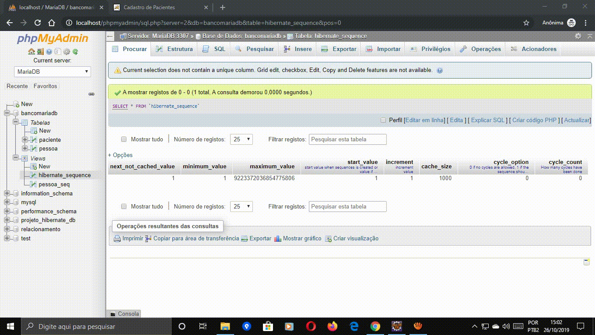
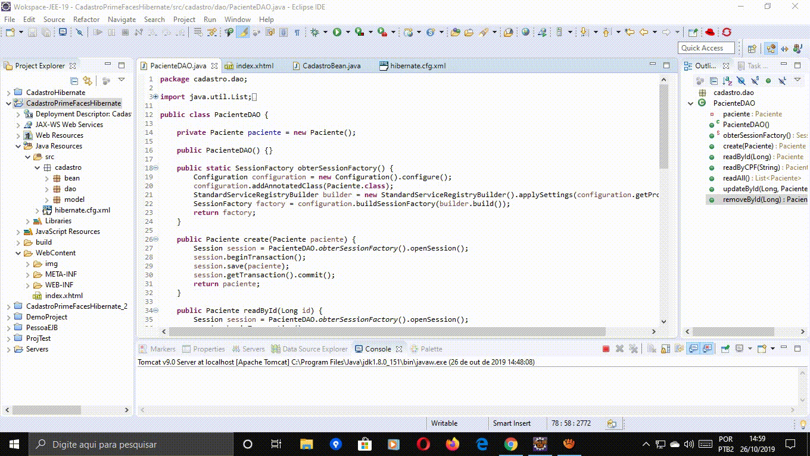

# primefaces-hibernate-crud
# Projeto Java EE feito com TomCat, PrimeFaces e Hibernate

# Cadastro De Clientes Com PrimeFaces Com Hibernate 5.4.5.

# Altere o nome de usuário e a senha do arquivo hibernate.cfg.xml que está na pasta src, caso contrário haverá erros no banco de dados MariaDB.

 
 
 
 
 
 
